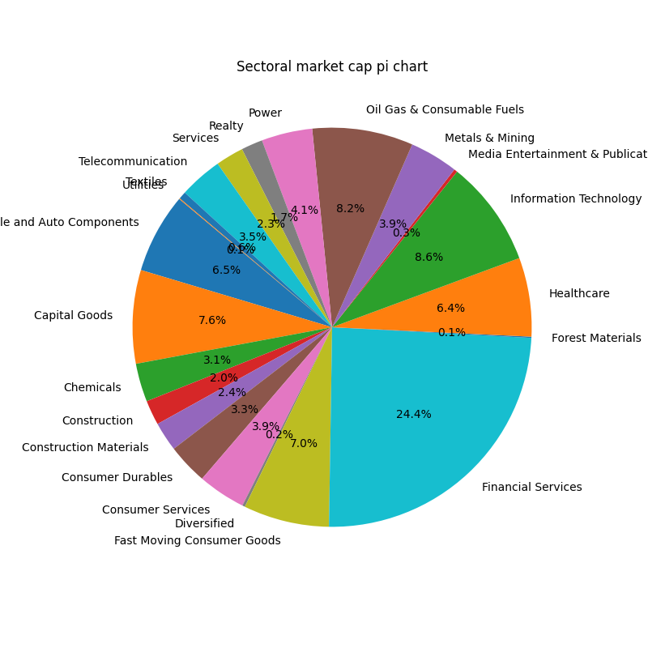

# nse_info
Helper library to fetch information about stocks from NSE website.

# Install via pip
```
pip install git+https://github.com/meet-minimalist/nse_info.git
```

# Usage
```
python -m nse_info.main -n 4 -o ./temp/ -l debug -p
```

# Help
```
python -m nse_info.main -h   
usage: main.py [-h] [-n NUM_THREADS] [-o OUTPUT_DIR] [-l LOG_LEVEL] [-p]

NSE Info package help.

options:
  -h, --help            show this help message and exit
  -n NUM_THREADS, --num_threads NUM_THREADS
                        Number of threads to use while fetching.
  -o OUTPUT_DIR, --output_dir OUTPUT_DIR
                        Output directory where cached data is stored.
  -l LOG_LEVEL, --log_level LOG_LEVEL
                        Select log level for processing. E.g. info, debug.
  -p, --plot            Plot the pi chart and sectoral charts in output dir.
```

# Note
- The tool currently supports fetching detailed information for every stock listed on the NSE website. The data includes stock symbol, market capitalization, PE ratio, surveillance information, total shares, industry, and sector details.
- This information is saved to a CSV file. Based on the CSV data, the tool generates a pie chart showing the distribution of all sectors and a heatmap for each sector. The resulting images are saved in the output directory.


